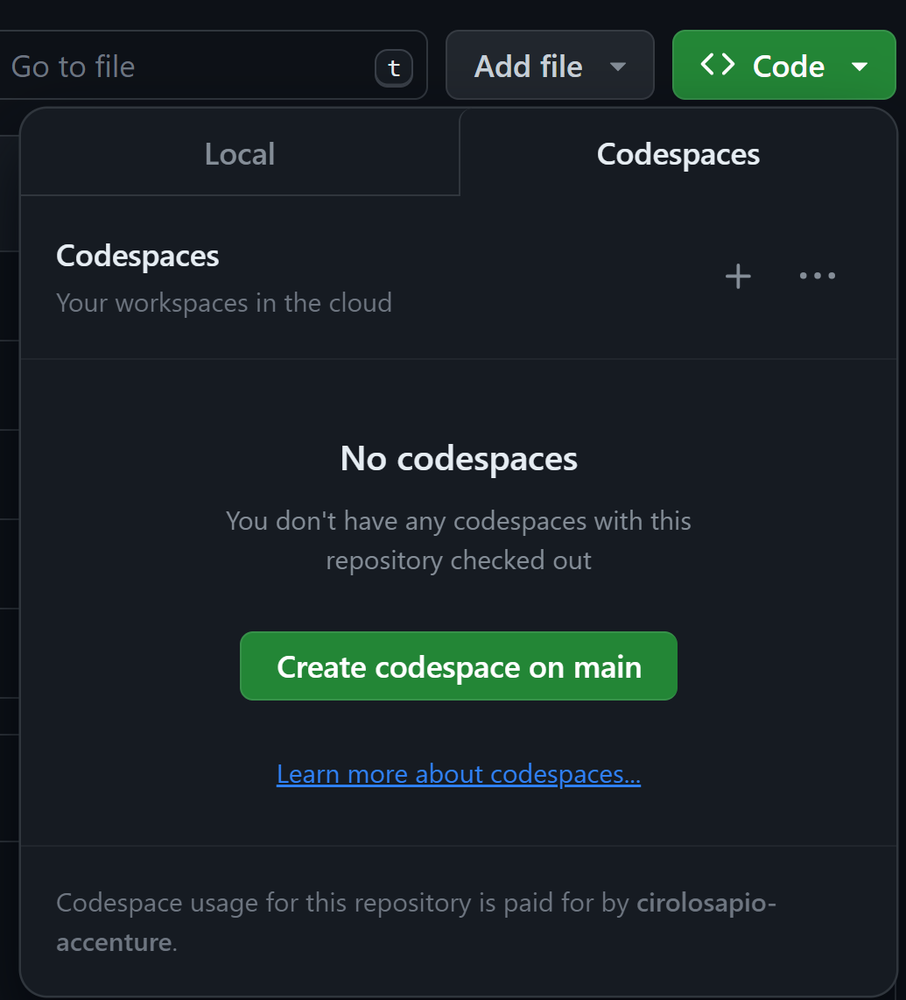

## Laravel Devcontainer Example

- `CTRL+SHIFT+P` seleziona `Dev Containers: Rebuild and Reopen in Container`
- `CTRL+ò` per aprire un terminale
  - lancia `composer install`
  - copia il file env con `cp .env.example .env`
  - lancia `php artisan key:generate`

## Run in Codespaces

- clicca su `Create codespace on main`
- (opzionale per avere il supporto docker) nel `devcontainer.json` aggiorna il valore di `hostDockerGid` a linea `24` in `800`